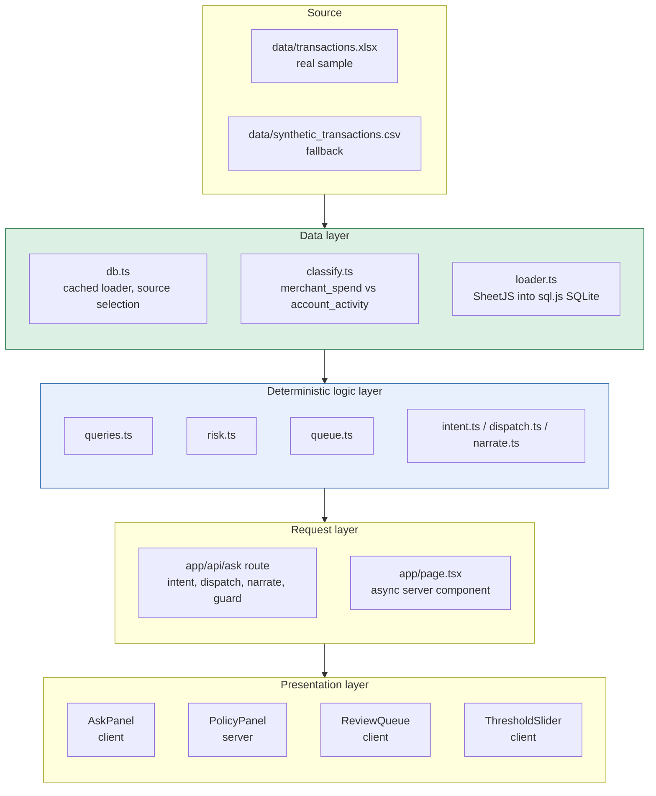

# Architecture

SpendGuard AI is one Next.js application, one deployable unit. The design rule is a strict one-way dependency: every dollar figure and count is produced by the deterministic data layer, and nothing above it is allowed to invent a number. The diagram shows how the layers stack, from the raw file at the bottom to the user interface at the top.

## Source

The data is a single anonymized sample spreadsheet, `data/transactions.xlsx`, provided with the Brim challenge. A small synthetic CSV, `data/synthetic_transactions.csv`, is committed alongside it as a fallback. Neither contains real customer or production data. The source is read once per process; nothing downstream touches the file directly.

## Data layer

`loader.ts` parses the spreadsheet with SheetJS and loads the rows into an in-memory SQLite database via sql.js (SQLite compiled to WebAssembly), so all querying is real SQL rather than ad-hoc JavaScript filtering. `classify.ts` then builds a `classified` view that labels every row as either `merchant_spend` (a genuine purchase at a merchant, a debit carrying a merchant category code) or `account_activity` (payments, interest, redemptions, fees). This classification is the backbone: every total downstream is computed over `merchant_spend` only, which is why the headline spend figure reflects actual merchant purchases and not bank movements. `db.ts` wraps this in a cached loader and selects the source: the real spreadsheet when present, the synthetic CSV otherwise, exposing an `isRealData()` flag the UI uses to show a demo-mode notice.

## Deterministic logic layer

This layer holds every computation, and it is the only place numbers come from. `queries.ts` produces totals, category and monthly breakdowns, and top merchants (with merchant-name normalization so store-numbered variants collapse to one merchant). `risk.ts` produces the over-$50 policy figure, exact-duplicate groups, same-day clusters, and the precomputed threshold curve, each carrying its evidence rows. `queue.ts` routes those risk candidates into review tiers and applies the operational down-ranking by merchant category code. The talk-to-data trio (`intent.ts`, `dispatch.ts`, `narrate.ts`) parses a question into a closed metric enum, runs the matching deterministic query, and produces a template narration. Every function in this layer is covered by a test suite that asserts the numbers against hand-checked values.

## Request layer

Two entry points consume the logic layer. `app/page.tsx` is an async server component that loads the database, computes the policy figure, the threshold curve, and the review queue at render time, and passes them as plain props to the presentation components. `app/api/ask/route.ts` handles a plain-English question: it parses intent, dispatches to the deterministic query, and then narrates. When an Anthropic API key is present it asks the model to narrate; the response then passes through a narration guard that checks every number in the model's sentence against the computed result. If the model introduces a figure the data does not support, the guard rejects the AI text and falls back to the verified template. Without a key, the template narrator runs directly. Either way the displayed numbers are the computed ones.

## Presentation layer

The components render the computed results and carry no business logic. `AskPanel` (client) handles the question input, calls the ask route, and renders the result by kind (single value, chart, table, policy, or risk groups) with an AI or Computed pill indicating the narration source. `PolicyPanel` (server) shows the $50 policy-reality block and the stated-but-not-measurable rules, and hosts the `ThresholdSlider` (client), which reads the precomputed curve and recomputes the documentation count live as the threshold moves. `ReviewQueue` (client) shows the three tiers and the top review candidates with expandable evidence, plus the caveat that the data has no employee, card, or timestamp field, so candidates are surfaced for a human to judge rather than presented as findings.
