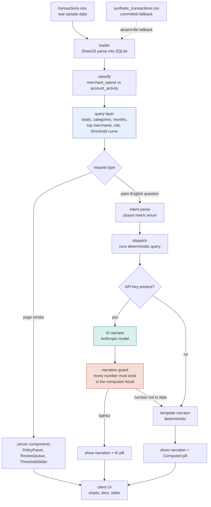

# SpendGuard AI

Spend intelligence and policy reality check for business card programs.

Live demo: https://spendguard-ai-lovat.vercel.app

## What it does

SpendGuard AI lets a finance manager ask plain-English questions about a company card program and get back the right answer with a fitting visualization: totals, category and monthly breakdowns, top merchants, and policy and risk checks. Every figure shown is computed directly from the transaction data by a deterministic engine. The AI layer only narrates those computed numbers, and the narration is verified against the computed result before display, so the user is structurally protected from seeing a number the data does not support.

## Key insights in the data

Three findings drive the tool, each computed from the statement rather than assumed:

- **Spend versus account noise.** The raw statement mixes genuine merchant purchases with account activity: payments, interest, redemptions, and fees. SpendGuard separates the two before computing anything, so totals reflect what the fleet actually spent at merchants ($1,510,738.52 across 4,147 merchant charges) rather than an inflated figure that double-counts bank movements.
- **The $50 policy-reality gap.** Brim's written policy requires manager pre-authorization for any expense over $50. Measured against the data, 65.5% of charges (2,736 of 4,180 debits) exceed that threshold. Applied literally, the control would gate roughly two-thirds of every transaction, a gap between the written rule and operational reality that a finance team needs to see.
- **Real duplicate candidates, ranked by judgment.** The tool surfaces exact-duplicate charges (150 groups) and same-day merchant clusters (595 groups) as review candidates, then down-ranks the operational noise (permits, tolls, and government crossings, identified by merchant category code) so genuine outliers rise to the top instead of a wall of routine permit charges. Candidates are framed for review, never as accusations.

## How it works

The flow below shows how a question or a page render moves through the system. Every dollar figure and count originates in the deterministic engine; the model only ever narrates a result the engine already produced.



The two colored nodes are the heart of the design: the **query layer** (blue) is the single source of every number, and the **narration guard** (red) is the gate that rejects any AI sentence containing a figure the data does not support, falling back to the verified template instead.

## About this project

This project is built on the sample dataset from Brim Financial's sponsored challenge at MPC Hacks 2026. I competed in the general track rather than the Brim challenge, so I built this independently afterward as a focused showcase, acting on advice given at the event that building a project tied to a company you want to join is worth more than sending applications.

The dataset is the dummy sample data Brim provided for the public hackathon challenge (participants were required to publish public repositories). It contains no real customer or production data: it is anonymized, merchant-level transaction data generated for the challenge. The accompanying expense policy used for the policy checks is the sample policy document provided with the challenge.

This is deliberately two features built well rather than a broad tool. What was intentionally left out, and why, is documented in `ASSUMPTIONS.md`.

## Stack

Next.js (App Router, TypeScript), sql.js (in-browser SQLite over the dataset), SheetJS for parsing, Recharts for visualization. The analytical engine is deterministic; an optional Anthropic model narrates results when an API key is present, otherwise a built-in template narrator is used. Both paths show the same computed numbers.

## Running it locally

```
npm install
npm run dev
```

Then open http://localhost:3000. The app reads the dataset at `data/transactions.xlsx`, builds an in-memory SQLite database, and renders the dashboard. To run the verification suites:

```
npm test
npm run test:queries
npm run test:risk
npm run test:ask
npm run test:queue
npm run test:threshold
```

The optional AI narration path activates when `ANTHROPIC_API_KEY` is set in `.env.local` (server-side only, never committed). Without a key, the deterministic template narrator runs instead and shows the same computed numbers.

## Documentation

- `ARCHITECTURE.md`: the layers, the data flow, and where the truth rule is enforced.
- `ASSUMPTIONS.md`: what is real versus simulated, the known limitations, and the risk-not-accusation language.

## Data source selection

The app loads the real sample dataset when present. If it is absent (for example in an environment where the file was not deployed), it falls back to a small committed synthetic dataset and labels the interface as demo mode, so the tool degrades gracefully rather than failing.
